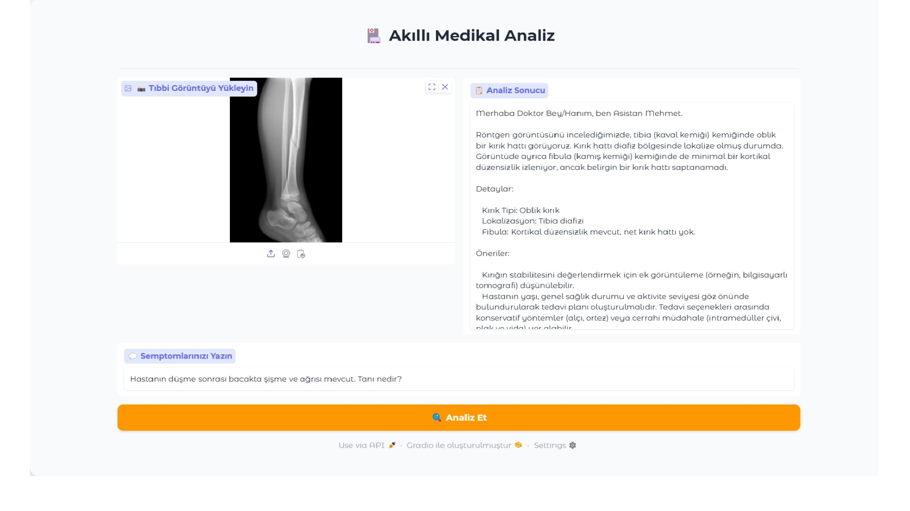

# Yapay Zeka Doktor Asistanı

Bu proje, tanı koyma aşamasında doktorlara yardımcı olmak için üretilen bir doktor asistanıdır. Doktorların girdiği hasta bilgilerine göre, hastayla ilgili göresellere ve klinik bilgiye dayanarak Gemini 2.0 kullanarak analiz eder. Doktorlara, girilen hasta ile ilgili olabilecek ön tanıları sıralar.

Doktorların kendi görüşlerine göre ön planda düşünebilecekleri hastalıkları seçip ileri araştırmaya devam edebilmeleri için tasarlanmış bir projedir. Bu program sayesinde daha fazla ön tanı belirlenip daha hızlı ve iyi bir tanı koyma aşaması gerçekleştirilebilir.

Kullanılan Kütüphaneler: Gradio, Google GenAI, PIL

Beni Hugging Face hesabımdan da takip edebilirsiniz.

